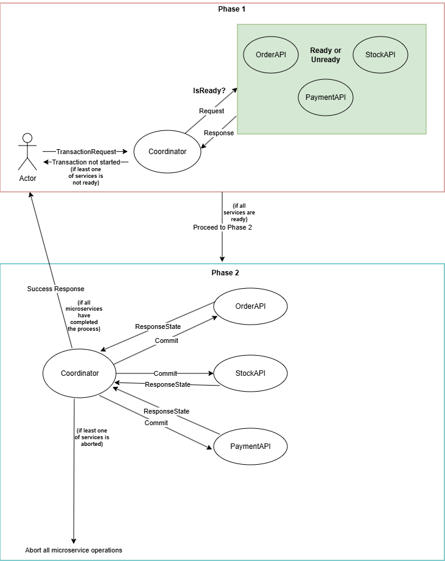

<h1>Strong Consistency - 2PC Protokolü ile Mikroservislerde Transaction Yönetimi ve Veri Tutarlılığı</h1>

<h1>1- Giriş</h1>

Mikroservislerde bazı durumlarda veri tutarlılığı oldukça kısa bir süre içerisinde sağlanması gerekebilir. Özellikle bankacılık uygulamaları(para transferi işleminde bakiye güncellenmesi) vs. gibi uygulamalarda sürenin çok tolere edilemeyeceği durumlarda strong consistency ile veri tutarlılığı sağlanabilir. Bu projede 4 ayrı mikroservis üzerinde gidilmiş olup order, stock ve payment mikroservislerinde ilgili transaction işlemi 2PC protokolü ile sağlanmıştır.

<h1>2- Strong Consistency ve 2PC Protokolü Nedir?</h1>

<b>StrongConsistency</b>, mikroservisler arası veri tutarlılığını sağlamak için kullanılan bir yaklaşımdır.Eventual consistency’e nazaran servisler arasında sıkı bir işlem bağımlılığı söz konusu ise kullanılır yani eventual consistecy’de tolere edilen zamansal fark burada söz konusu değildir. Her bir mikroservis ilgili işlemi bir bütün olarak ele alır, ya veri tutarlılığı sağlanır ya da sağlanamaz. Strong Consistency'de ilgili işlem bütün olarak ele alınıp bunun neticesinde tüm servisler'e aynı anda müdahale edilip servisler'de kitlenme durumu oluşacağından bu yaklaşımda performans düşüşü görülebilmektedir. <b>2PC protokolü</b> ise strong consistency yaklaşımının implemente edilmiş halidir. 2PC protokolünde sistemimizde mevcut olan mikroservislere ek olarak bir de <b>coordinator servis'imiz</b> bulunmaktadır. Coordinator servis'i transaction'ı başlatır ve sonuna kadar her aşamayı koordine eder, başlangıçta her bir mikroservis'in transaction için hazırlık durumunu kontrol eder, hepsinden onay gelmesi durumunda transaction'ı başlatır işlem sonunda tüm mikroservisler olumlu dönerse işlem başarıyla tamamlanır, bir mikroservis'den bile olumsuz dönmesi veya yanıt alınamaması durumunda ise transaction başarısız olur ve ilgili mikroservislerde yapılan tüm işlemler rollback ile geri alınır(compensable transaction). 2PC protokolü Prepare Phase ve Commit Phase olmak üzere iki aşamadan oluşmaktadır. Prepare aşamasında koordinator, transaction'a katılan her bir mikroservis'in bu işlem için hazır olup olmadıkları bilgisini alır, mikroservisler'in en az birinden olumsuz yanıt gelmesi veya yanıt alınamaması durumunda ise transaction işlemi başlamaz, iptal olur. Koordinator tüm mikroservislerden olumlu yanıt alması durumunda ise Commit Phase aşaması başlar, bu aşamada ilgili transaction'a katılan mikroservisler'in işlemlerine başlaması için her birine commit mesajı gönderilir. Koordinator, mikroservislerden olumlu yanıt gelmesi üzerine transaction'ı tamamlar ve kullanıcıya başarılı durumunu döner ancak mikroservislerin en az birinden yanıt gelmemesi veya olumsuz gelmesi üzerine tüm mikroservislerin işlemlerini geri alması için rollback mesajı gönderir.

<h1>3- Akış Şeması</h1>

<h1>4- Projenin İşleyişi</h1>

Projede veri tutarlılığı strong consistency üzerinden sağlanmıştır. Öncelikle kullanıcı tarafından oluşturulan transaction isteği coordinator servis'e gelir. Coordinator servis, transaction ile ilgili işleme girecek tüm servislere hazır olup olmadıklarına dair bir request gönderir, eğer servislerden en az biri bu isteğe cevap veremez veya false dönerse transaction işleme girmeden sonlanır ve kullanıcıya abort yanıtı döner. Eğer tüm servislerimiz hazır yanıtı dönerse o zaman 2PC protokolünde ikinci aşamaya geçilir. 2. aşamada transaction'a giren tüm servislere işlemlerini gerçekleştirmesi için commit request'i gönderilir, mikroservislerin gerçekleştirdikleri işlemler neticesinde eğer en az bir mikroservis local transaction'ını tam olarak gerçekleştiremez, yarıda kalır veyahut coordinator'e yanıt dönemezse işlemlerini başarıyla gerçekleştiren tüm mikroservislerin yaptıkları işlemler geri alınır (compensable transaction) ve yine kullanıcıya abort yanıtı döner. Eğer mikroservislerdeki tüm local transactionlar başarılı olursa kullanıcıya işlem başarılı yanıtı dönülür. Dikkat edilecek olursa burada transaction her aşamada bir bütün olarak ele alınmıştır yani aşama 1 veya 2'de local transactionlar'da oluşabilecek herhangi bir sorunda transaction otomatik olarak en kısa sürede iptal olur. Burada eğer ilk aşama geçilirse 2. aşamada zaten tüm mikroservislerin ready durumu teyit edildiği için oluşabilecek herhangi bir sorunda ayakta ve sağlıklı olan bu mikroservisler hızlı bir şekilde transactionlar'ını geri alabilmektedir. Olaki 2. aşamada yine bir bağlantı kopukluğu vs. durum olursa yine coordinator hızlı bir şekilde transaction'ı abort eder. Eventual consistency'de ise bu reaksiyon durumu daha esnektir yani oluşabilecek herhangi bir compensable transaction durumunda ilgili mikroservis ayakta olmayabilir, belirli bir süre neticesinde ayağa kalktığında transaction'ı geri alır.

<h1>5- Kullanılan Teknolojiler</h1>
<ul>
<li>Asp.Net Core API 9.0</li>
<li>RabbitMQ - MassTransit</li>
<li>Asp.Net InMemory Cache</li>
<li>MSSQL</li>
<li>Ef Core 9.0</li>
<li>Microservices</li>
</ul>